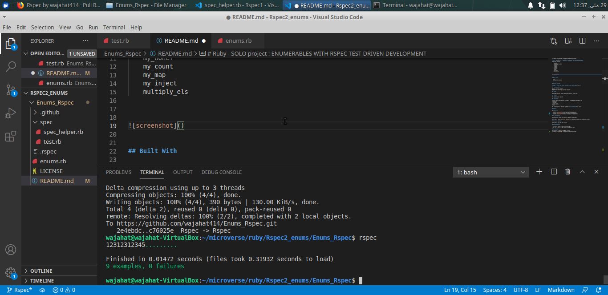

# Ruby - SOLO project : ENUMERABLES WITH RSPEC TEST DRIVEN DEVELOPMENT
Enumerable Methods:

    my_each
    my_each_with_index
    my_select
    my_all?
    my_any?
    my_none?
    my_count
    my_map
    my_inject
    multiply_els





## Built With

- Ruby
- VS code Linux Xubuntu


## Getting Started

**To get a local copy up and running follow these simple steps.**

```
$ git clone https://github.com/wajahat414/Enums_Rspec.git
$ cd ruby-enumerables
```
Don't know anything about git? Checkout this 👉🏼 [Getting Started With Git](https://towardsdatascience.com/getting-started-with-git-and-github-6fcd0f2d4ac6?gi=f8ce126417c7)

To examine the program's results you can run this command:

```
$ irb ./test.rb
```
You can also use [Online Ruby Compiler](https://www.tutorialspoint.com/execute_ruby_online.php). Just copy the contents of test.rb there and it will execute the program for you.

Testing With Rspec
- Test cases have been written carefully to make sure the public methods works as expected
- From the Terminal run the command
$ rspec

### Prerequisites

-Windows or Linux machine 
-Web browser other than Internet Explorer

### Install

-No installation required

### Deployment

-You can deploy this project cloning it on GitHub and then going to:
->Repository
->Settings
->GitHub Pages
(Select source)
->Save

The project will be deployed to https://<wajahat414>.github.io/<>/

## Authors

👤 **Author**

- GitHub: [@wajahat414](https://github.com/wajahat414)
- Twitter: [@wajahat414](https://twitter.com/wajahat414)
- linkedIn: [@wajahat414](https://linkedin.com/wajahat414)

## 🤝 Contributing

Contributions, issues, and feature requests are welcome!

Feel free to check the [issues page](https://github.com/wajahat414/Ruby_enums/issues).

## Show your support

Give a ⭐️ if you like this project

## Acknowledgments

- Microverse (https://www.microverse.org/)
- The Odin Project (https://www.theodinproject.com/)

## 📝 License

This project is [MIT](./LICENSE) licensed.
